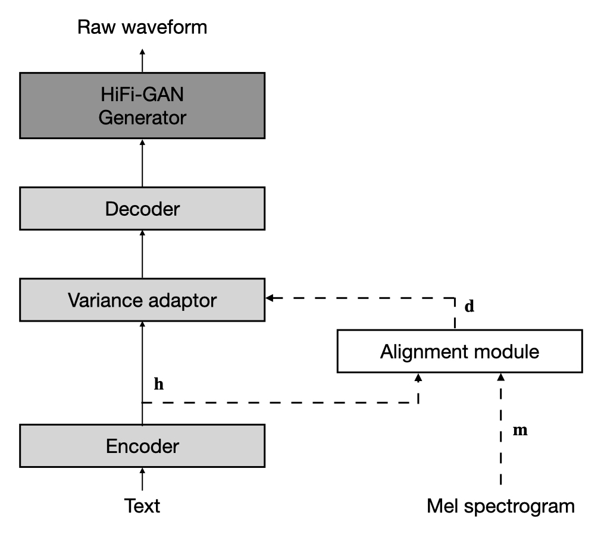

# JETS: Jointly Training FastSpeech2 and HiFi-GAN for End to End Text to Speech

Pytorch implementation based on ESPNet (https://github.com/espnet/espnet) toolkit; tag: v.202204

paper: https://arxiv.org/abs/2203.16852

demo: https://imdanboy.github.io/interspeech2022/
<p align="center"></p>

JETS consists of FastSpeech2, HiFi-GAN and an Alignment Module. The model files are located at `espnet2/gan_tts/jets/`

## How to use

1. clone the repo
```
git clone https://github.com/imdanboy/jets.git
```
2. patch the provided code to espnet
```
cd jets; ./patch_to_espnet.sh
```
3. install espnet as usual
```
cd jets/espnet/tools
./setup_venv $(which python3)
make
```
4. run the training script // tested on 4 V100 GPUs
```
# LJSPEECH training
cd jets/espnet/egs2/ljspeech/tts1
./run.sh --stage 1 --stop_stage 6 --ngpu 4
# KSS training
cd jets/espnet/egs2/kss/tts1
./run.sh --stage 1 --stop_stage 6 --ngpu 4
```
